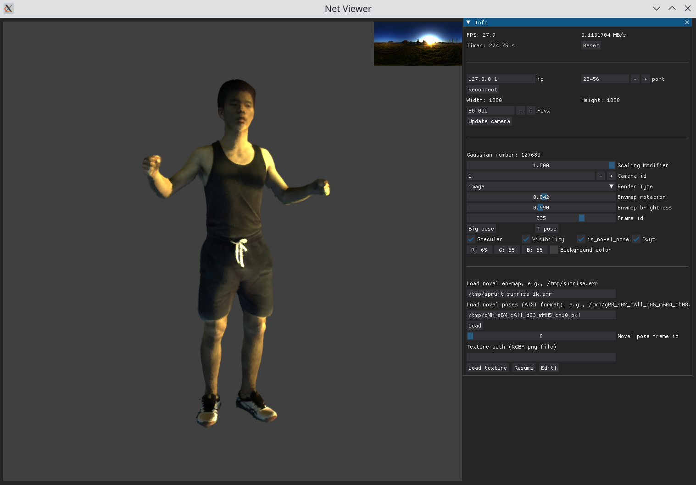

# Interactive Rendering of Relightable and Animatable Gaussian Avatars

### [Projectpage](https://gapszju.github.io/InteractRAGA) · [Paper](https://ieeexplore.ieee.org/document/11006750) · [Arxiv](https://arxiv.org/abs/2407.10707) · [Video](https://www.youtube.com/watch?v=hCNf8zVQWLU)

## Installation

1. Download and install necessary packages.

```shell
conda create -n RAGA python=3.10
conda activate RAGA

pip install torch==2.4.1 torchvision numpy<2.0 --index-url https://download.pytorch.org/whl/cu121 
pip install iopath plyfile scipy opencv-python imageio scikit-image tqdm websockets tensorboardX tensorboard yaml pynvjpeg open3d trimesh rtree

pip install --no-index --no-cache-dir pytorch3d -f https://dl.fbaipublicfiles.com/pytorch3d/packaging/wheels/py310_cu121_pyt241/download.html
pip install git+https://github.com/NVlabs/nvdiffrast.git@main#nvdiffrast

cd submodules/diff-gaussian-rasterization/ && pip install .
```

2. Install [frnn](https://github.com/lxxue/FRNN), a fixed radius nearest neighbor search implementation which is much faster than [pytorch3d knn_points](https://pytorch3d.readthedocs.io/en/latest/modules/ops.html#pytorch3d.ops.knn_points).
 
3. Download [SMPL](https://smpl.is.tue.mpg.de/) model, place `SMPL_FEMALE.pkl`, `SMPL_MALE.pkl`, `SMPL_NEUTRAL.pkl` file to `./smpl_model/smpl/`. Then follow [this link](https://github.com/vchoutas/smplx/tree/main/tools) to remove chumpy objects from the model data. 

## Dataset Preparation

1. Download [SyntheticDataset](https://drive.google.com/drive/folders/1kKGelKcufAypLefugBmmOauMfIEc1ZbU?usp=sharing), [ZJUMoCap](https://github.com/zju3dv/instant-nvr/blob/master/docs/install.md#set-up-datasets), or [PeopleSnapshot](https://graphics.tu-bs.de/people-snapshot) datasets. For [ZJUMoCap](https://github.com/zju3dv/instant-nvr/blob/master/docs/install.md#set-up-datasets) dataset, we use the refined version from [instant-nvr](https://github.com/zju3dv/instant-nvr) because the mask is cleaner. 
2. For PeopleSnapshot dataset, use `script/peoplesnapshot.ipynb` to process the dataset.
3. Prepare the template mesh. We have included the template file in `./template`. Place the template file in `{DATASET_DIR}/lbs/bigpose_mesh.ply` for each dataset case. 
   - You can also reconstruct the template mesh by following [this link](https://github.com/wenbin-lin/RelightableAvatar). Note that the obtained mesh needs to be re-meshed to approximately 40K vertices. 

The dataset will look like this after preparation. 
```
DATASET_DIR
├── annots.npy
├── images
│   ├── 00
│   │   ├── 000000.jpg
│   │   └── 000001.jpg
│   └── 01
├── lbs
│   └── bigpose_mesh.ply
├── mask
│   ├── 00
│   │   ├── 000000.png
│   │   └── 000001.png
│   └── 01
└── params
    ├── 0.npy
    └── 1.npy
```

## Training
```shell
python train.py -s {DATASET_DIR} -m {MODEL_DIR} -c ./config/{DATASET-TYPE}.yaml [--port {PORT}]
```
It will take about 1 hours on a RTX 3090. 

## Visualization

To visualize the results during training, open the viewer, set ip, port, and connect
```shell
cd viewer
python net_viewer.py 
```

To visualize a trained model
```shell
python visualize.py -m {MODEL_DIR} --ip {IP} --port {PORT}

cd viewer
python net_viewer.py
```
Please refer to [the video](https://youtu.be/hCNf8zVQWLU?t=138) for instructions on how to use it and edit the appearance.



## Acknowledgement
We use the rasterizer and some data processing code from [Gaussian-Splatting](https://github.com/graphdeco-inria/gaussian-splatting). This project also uses [RelightableAvatar](https://github.com/wenbin-lin/RelightableAvatar) for mesh extraction, [nvjpeg-python](https://github.com/UsingNet/nvjpeg-python) for image encoding and decoding, and [frnn](https://github.com/lxxue/FRNN) for fast KNN calculation.  We greatly thank the authors for their wonderful works.

## Citation
```bibtex
@article{zhan2024interactive,
  title={Interactive Rendering of Relightable and Animatable Gaussian Avatars},
  author={Zhan, Youyi and Shao, Tianjia and Wang, He and Yang, Yin and Zhou, Kun},
  journal={arXiv preprint arXiv:2407.10707},
  year={2024}
}
```

